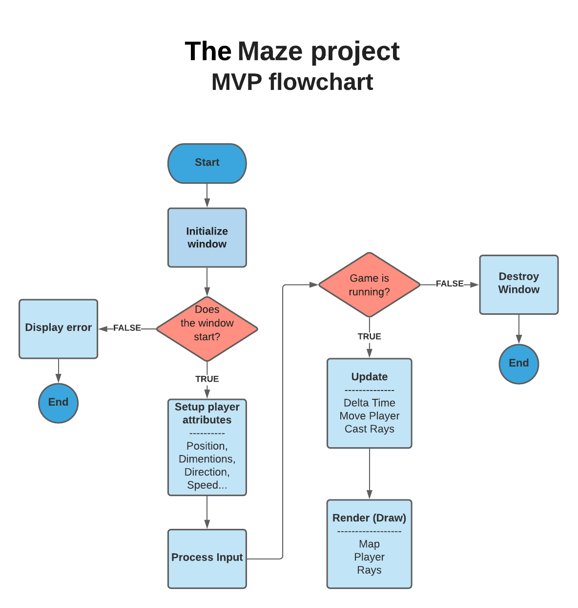

# THE MAZE PROJECT:

 it's a 3D game project powered by alx foudation that uses raycasting to render a 2D map into 3D 

# USED LANGUAGE:

- C PROGRAMMING LANGUAGE
 
#### ABOUT SDL2:

It is a cross-platform development library designed to provide low-level access to audio, keyboard, mouse, joystick, and graphics hardware via OpenGL and Direct3D. SDL2 simplifies the process of creating multimedia applications such as games, emulators, and media players by abstracting away platform-specific details. 

# HOW TO USE:

- Execute {./maze} 
- Use {Q-S-D-Z} for movement (it depends on your keyboard) 

# COMPILATION:

$ gcc -Wall -Werror -Wextra -pedantic ./src/*.c -lm -o maze `sdl2-config --cflags` `sdl2-config --libs`;

# FlowChart:

# Author ✒️:
- walid gzouly <<https://github.com/waliddx>>

